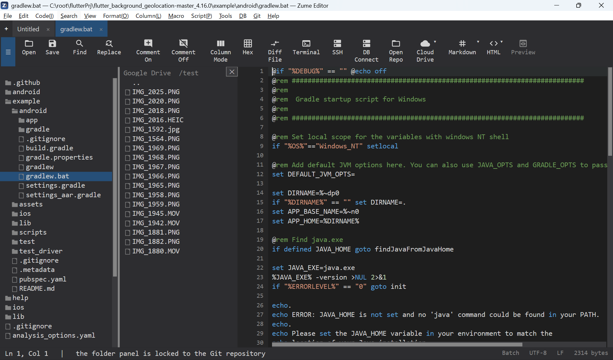

# CloudDrive

Open and edit files stored in your cloud storage accounts:

- **Dropbox**
- **Google Drive**
- **OneDrive**
- **Box**

Connect an account with **Remote → CloudDrive** and sign in through the provider's
own secure sign-in (OAuth) - Zume Editor never sees your cloud password. Browse the
drive in the sidebar, open a file in a tab, and save to upload it back.

{ loading=lazy }

!!! note
    CloudDrive is for consumer cloud storage. For your own servers, use
    [Remote Files (SFTP / FTP / FTPS)](remote.md).

## You provide your own OAuth app credentials

Zume Editor does not ship a built-in cloud client. The first time you connect a
provider you enter **your own OAuth app's credentials** (a Client ID, and for
most providers a Client Secret). You create that app once, in the provider's
developer console - it is free, takes a few minutes, and the credentials are
stored in your OS credential store (never in a file), shared with `zume-cli`.

### The redirect URI

Google Drive, OneDrive and Box finish the sign-in by redirecting to a small local
server Zume Editor runs. Register this **exact** redirect URI in your app:

```text
http://localhost:53682/callback
```

A mismatch here is the most common setup error (`redirect_uri_mismatch`). Dropbox
uses a paste-the-code flow instead and needs no redirect URI.

## Connecting the first time

1. **Remote → CloudDrive → Connect to &lt;provider&gt;**.
2. Enter the **Client ID**, then the **Client Secret** (Dropbox asks only for the
   app key; OneDrive only for the Client ID).
3. Your browser opens the provider's consent page - approve access. (Dropbox
   shows a code to paste back into the editor instead.)
4. Zume Editor catches the redirect on `localhost:53682` (within ~3 minutes) and
   saves the token. The drive appears in the sidebar.

Next time, the saved token is reused - no browser step - until you
**Remote → CloudDrive → Disconnect** (or `logout` in the CLI).

## Where to get the Client ID / Client Secret

### Google Drive

1. Open the [Google Cloud Console](https://console.cloud.google.com/) and create
   or select a project.
2. **APIs & Services → Library** → enable **Google Drive API**.
3. **APIs & Services → OAuth consent screen** → set it up (User type **External**;
   while the app is in *Testing*, add your Google account under **Test users**).
4. **APIs & Services → Credentials → Create credentials → OAuth client ID** →
   Application type **Web application**.
5. Under **Authorized redirect URIs** add `http://localhost:53682/callback`.
6. Create it, then copy the **Client ID** and **Client secret**.

### Dropbox

1. Open the [Dropbox App Console](https://www.dropbox.com/developers/apps) →
   **Create app** → **Scoped access**, and choose Full Dropbox or App folder.
2. On the app's **Permissions** tab enable the file scopes (read and write).
3. Copy the **App key** from the **Settings** tab. (Dropbox uses the
   paste-the-code flow, so no redirect URI and no secret are needed.)

### OneDrive

1. Open the [Azure Portal](https://portal.azure.com/) → **App registrations** →
   **New registration**.
2. Add a redirect URI `http://localhost:53682/callback` (as a Mobile & desktop /
   public client - no secret is used).
3. Grant the delegated **Files.ReadWrite** permission.
4. Copy the **Application (client) ID**.

### Box

1. Open the [Box Developer Console](https://app.box.com/developers/console) →
   **Create New App → Custom App → User Authentication (OAuth 2.0)**.
2. Set the redirect URI to `http://localhost:53682/callback`.
3. Copy the **Client ID** and **Client Secret** from the app's Configuration.

## From the command line

```text
zume-cli cloud googledrive login <client_id> <client_secret>
zume-cli cloud dropbox     login <app_key>
zume-cli cloud onedrive    login <client_id>
zume-cli cloud box         login <client_id> <client_secret>

zume-cli cloud <provider> ls [path]
zume-cli cloud <provider> get <remote> <local>
zume-cli cloud <provider> put <local> <remote>
zume-cli cloud <provider> logout
```

The CLI uses the same loopback sign-in and shares the saved token with the editor.
See the [Command Line](cli.md) page for details.
