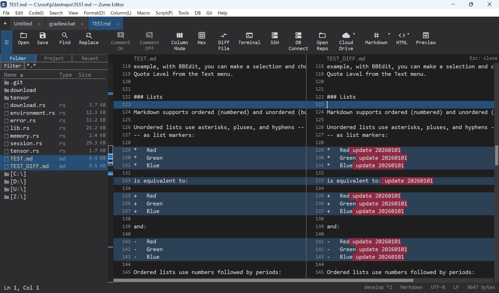

# Compare & Merge

## Compare files

**Compare → Compare With File** opens a two-pane diff. Both panes are **editable**
and re-diff live, so you can resolve differences by editing or by **taking a block**
from the other side (merge). Navigate differences with ++f7++ / ++shift+f7++.

## Compare folders

**Compare → Compare Folders** walks two trees and lists each path as *same*,
*different*, *left only* or *right only*. Open a file from the list to diff it.

## Byte compare

For binary files, **Compare Bytes With File** aligns both files as hex rows.

## Merge conflicts

Open a file with Git conflict markers and use **Merge → Next/Previous Conflict**
and **Take Ours / Theirs / Both** to resolve each conflict as one undo step.

{ loading=lazy }
