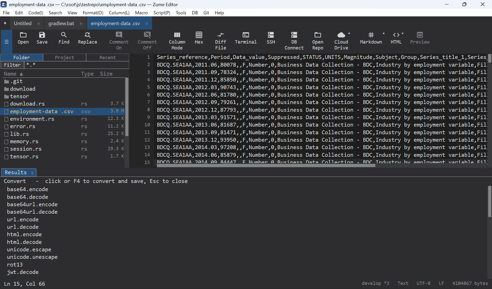

# File conversion & archives

Zume Editor converts text and data between many formats, exports Markdown / HTML
to PDF, and creates and extracts zip / tar / 7z archives — from the editor and
from the `zume-cli` command line.

## Convert a file

**Convert: Convert File…** (in the command palette / Tools) lists every
converter. Pick one and choose where to save; the result is written to the file
you pick. The active document is the input.

{ loading=lazy }

Available converters:

| Group | Converters |
| --- | --- |
| Text encodings | Base64 / Base64URL encode·decode, URL encode·decode, HTML-entity encode·decode, Unicode escape·unescape, ROT13, Base32 encode·decode |
| Tokens | JWT decode |
| Data | CSV ↔ JSON, CSV ↔ TSV, CSV → Markdown table, CSV → HTML, CSV → SQL, JSON ↔ YAML, JSON ↔ TOML, JSON ↔ INI, JSON minify / pretty, HTML → Markdown |
| Compression (single stream) | gzip, zlib and bzip2 — compress / decompress |

!!! note
    gzip / zlib / bzip2 here compress one file into one stream. For multi-file
    `.tar.gz` / `.tar.bz2` archives, see [Archives](#archives) below.

## Export to PDF

A Markdown or HTML document can be saved as PDF:

- **File → Export to PDF…**, or the **to PDF** entry in the Convert File picker,
  or the CLI (below).
- A save dialog asks where to write the `.pdf`.
- Rendering uses the platform's own engine (Windows: the Edge WebView2 runtime;
  macOS: Core Graphics; Linux: Pango / Cairo), so Japanese and other scripts
  render with the system fonts.

## Archives

Create and extract archives from the **folder panel** (right-click a file or
folder):

- **Extract Here** — on an archive file, extracts into a sibling folder named
  after the archive.
- **Compress…** — on a file / folder (or a multi-selection), asks where to save;
  the **extension you choose picks the format**.

| Format | Extract | Create |
| --- | :---: | :---: |
| `.zip` | ✅ | ✅ |
| `.tar`, `.tar.gz` / `.tgz`, `.tar.bz2` / `.tbz2`, `.tar.xz` / `.txz` | ✅ | ✅ |
| `.7z` | ✅ | ✅ |
| `.rar` / RAR5 | ✅ | — |
| `.xz` | ✅ | — |

!!! note
    RAR is extract-only (the format is proprietary). Encrypted RAR / 7z is not
    supported. A `.7z` entry whose name is non-ASCII may not round-trip through
    the 7z container (the file contents are unaffected).

## From the command line

```text
# Conversion
zume-cli convert                      # list all converters
zume-cli convert <id> <in> [out]      # convert a file (stdout if no out)
zume-cli convert md.toPdf   in.md  out.pdf
zume-cli convert html.toPdf in.html out.pdf

# Archives
zume-cli archive list    <archive>
zume-cli archive extract <archive> [dest-dir]     # default: .
zume-cli archive create  <archive> <path>...      # format by extension
```

`create` writes `.zip`, `.tar`, `.tar.gz` / `.tgz`, `.tar.bz2` / `.tbz2`,
`.tar.xz` / `.txz` and `.7z`; `extract` also reads `.rar` and `.xz`. See the
[Command Line](cli.md) page for the full CLI reference.
