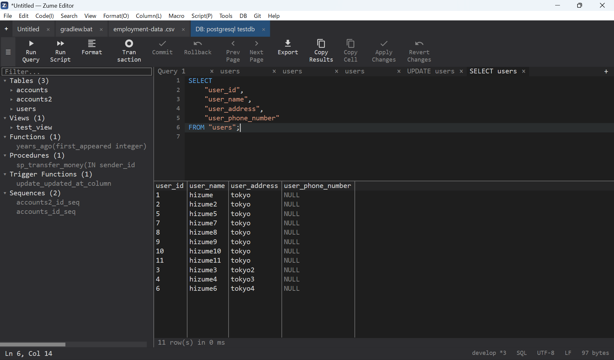

# Database

Connect to a database, browse its schema and run queries from inside the editor,
with results shown in a grid.

## Supported databases

**SQL**

| Engine | Notes | Default port |
| --- | --- | --- |
| **SQLite** | Local database file, or a new / in-memory database | — (file) |
| **MySQL / MariaDB** | Also MySQL-compatible servers (e.g. TiDB) | 3306 |
| **PostgreSQL** | Also PostgreSQL-compatible servers | 5432 |
| **Microsoft SQL Server** | Over the native TDS protocol | 1433 |

**NoSQL**

| Engine | Notes | Default port |
| --- | --- | --- |
| **Redis** | RESP protocol | 6379 |
| **MongoDB** | MongoDB wire protocol | 27017 |

## Connecting

- **SQLite** - open a database file (e.g. `.db` / `.sqlite`), or create a new one.
- **Server engines** - provide host, port (leave it at the default to use the
  engine's standard port), user, password and, optionally, a default database.
  **TLS is used by default** for networked engines.

!!! tip "Credentials are protected"
    Connection passwords are stored in your operating system's secure credential
    store (Windows Credential Manager, macOS Keychain, Linux Secret Service), never
    in plain settings or session files. See [Privacy & Security](privacy.md).

## Working with a connection

- **Schema browser** - tables and views with their columns, types, primary keys and
  indexes; and, for engines that have them, functions, stored procedures, triggers
  and sequences.
- **Run SQL** - write a statement and run it; results appear in a grid (large result
  sets are capped and marked *truncated*). For statements that change data, the
  number of **affected** rows and the execution time are reported.
- **Inline edit** - edit result cells; writes use parameterized statements, so
  values (text, numbers, blobs, NULL) are bound safely without hand-quoting.
- **NoSQL** - Redis and MongoDB connections run commands / queries and show the
  results in the same panel.

{ loading=lazy }
