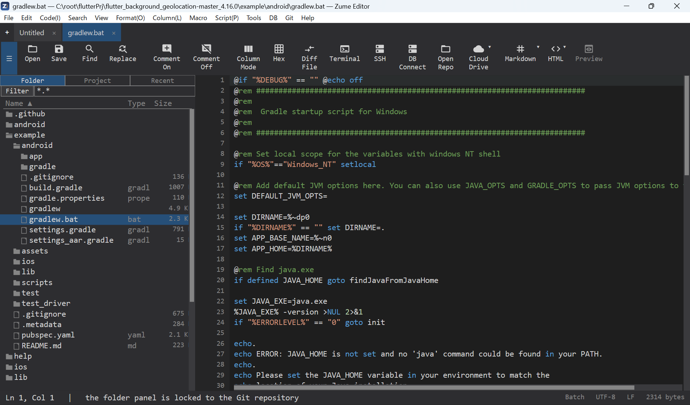
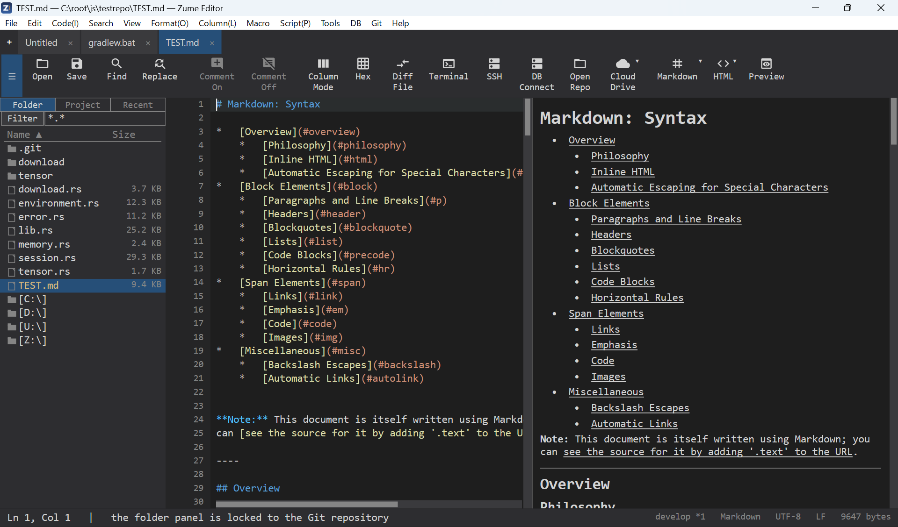

# Getting Started

A quick tour so you can find your way around.

## The window

- **Tabs** - each open file is a tab. Drag to reorder; ++ctrl+t++ opens a new tab,
  ++ctrl+w++ closes one.
- **File panel (sidebar)** - toggle with ++ctrl+b++. Browse folders, Recent and
  Projects; it has an Explorer-style tree with detail columns.
- **Editor area** - split a tab into two panes (vertical/horizontal), or show two
  different files side by side.
- **Bottom / side panels** - search results, the [Terminal](terminal-ssh.md),
  compare output and more. Panels are dockable.
- **Status bar** - line/column, language, encoding, line ending and more. Click
  the encoding or language to change it.

{ loading=lazy }

## First steps

1. **Open** a file or folder - ++ctrl+o++, or drag files onto the window.
2. **Edit** - type as usual. Undo/redo is ++ctrl+z++ / ++ctrl+y++.
3. **Find** - ++ctrl+f++ for the find bar; ++ctrl+r++ for the full Find &
   Replace dialog. See [Search & Replace](editing/search.md).
4. **Save** - ++ctrl+s++.

## The command palette

Press ++ctrl+shift+p++ to search and run any command by name - the fastest way to
discover features. Each command shows its keyboard shortcut.

## Markdown & HTML preview

Open a Markdown or HTML file and turn on **View → Toggle Markdown / HTML Preview**
to see a live preview beside the editor. The preview updates as you type.

{ loading=lazy }
