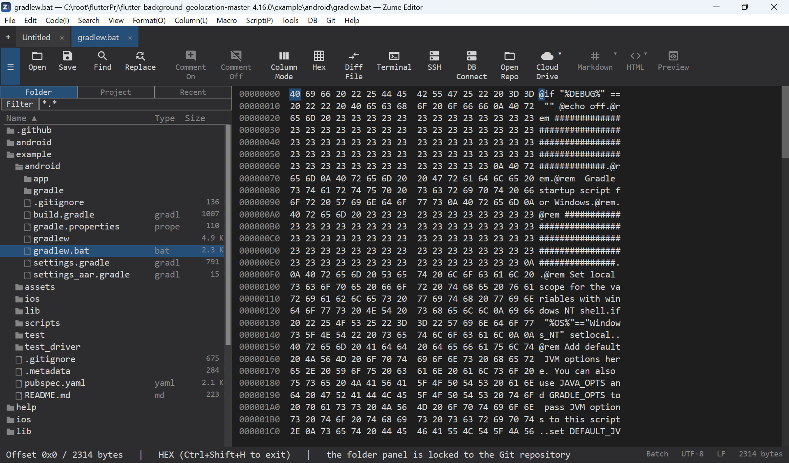

# Hex / バイナリエディター

++ctrl+shift+h++（またはコマンドパレット）で、タブをHex表示に切り替えます。

- **オフセット / 16進 / ASCII** の列。カーソルは16進・ASCII両方で強調されます。
- バイトの **選択**（Shift+移動またはドラッグ）、**コピー**（16進 / 生）、バイト列の
  **検索 / 置換**（`48 65` や `4865`、通常テキストでも可）。
- バイトの **挿入 / 上書き**。編集はテキスト表示と1つの取り消し履歴を共有します。
- **EBCDIC** 列（任意）、**1行あたりバイト数**（8 / 16 / 32）の設定。
- [大容量ファイル](editing/large-files.md) でも動作し、
  [2ファイルをバイト単位で比較](compare.md) できます。

{ loading=lazy }
