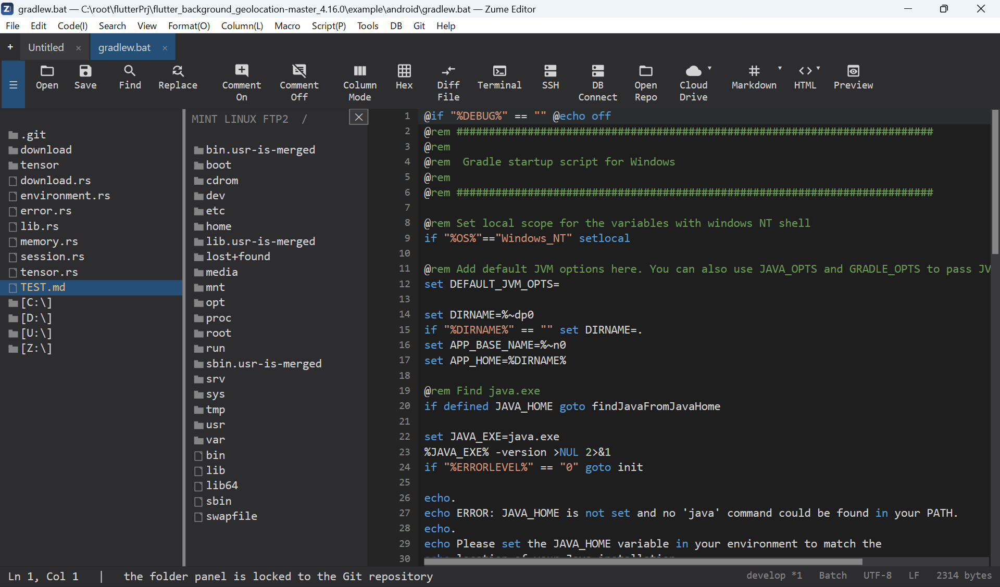

# Remote Files (SFTP / FTP / FTPS)

Edit files directly on a remote server.

1. **Remote → Connect** - choose the scheme (**SFTP**, **FTP** or **FTPS**) and
   enter host, port, user and password (or an SSH key for SFTP).
2. The sidebar becomes a remote browser - click folders to navigate, click a file
   to open it in a tab.
3. **Save** (++ctrl+s++) uploads the file back to the server.

- **Host-key trust** - SFTP uses trust-on-first-use; you confirm an unknown key's
  fingerprint once. FTPS certificate problems ask before continuing.
- **Saved connections** - store connection profiles (never the password unless you
  choose to save it, and then only in your OS secure store).
- Several connections can be open at once, each as its own tab.

See also [Terminal & SSH](terminal-ssh.md) for an SSH shell, and
[CloudDrive](clouddrive.md) for cloud storage.

{ loading=lazy }
