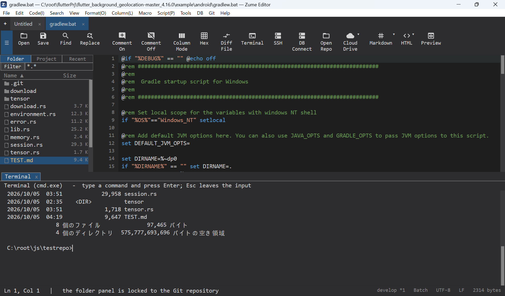
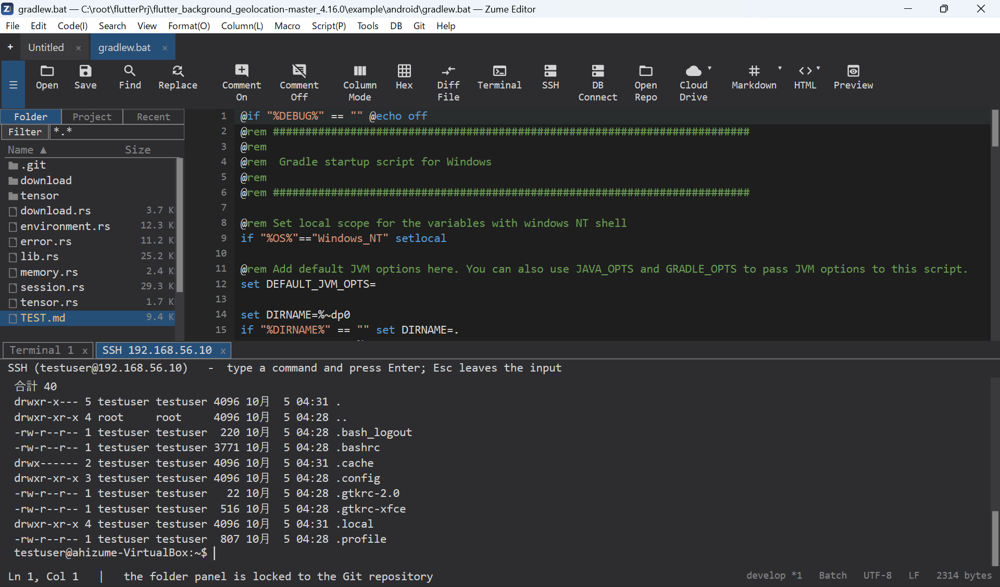

# Terminal & SSH

## Terminal panel

**View → Terminal Panel** opens an interactive shell in a dockable panel
(`cmd.exe` on Windows, your login shell on macOS/Linux). You can open several
terminals as tabs, type directly, use command history (++up++ / ++down++), select
and copy output, and interrupt with ++ctrl+c++.

## SSH shell

**View → SSH Panel** opens a shell on a remote host over SSH. It rides the same
connection as the SFTP browser, or you can connect directly. Password and key
authentication are supported (see [Remote Files](remote.md)).

!!! note
    This is an interactive shell panel, not a full terminal emulator.

{ loading=lazy }

{ loading=lazy }
